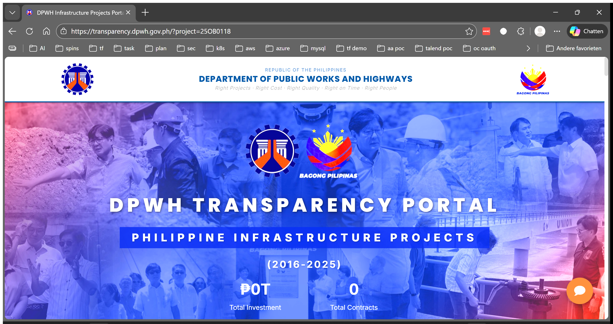
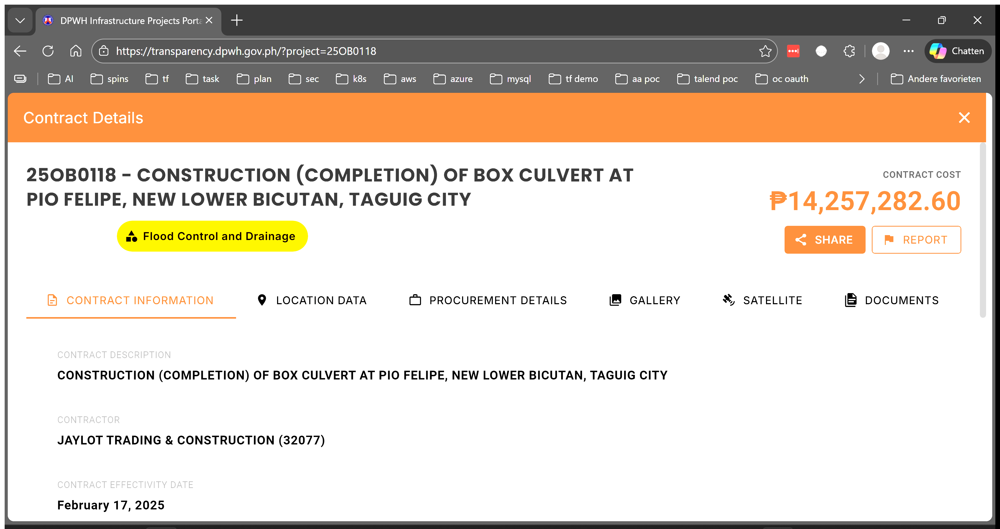
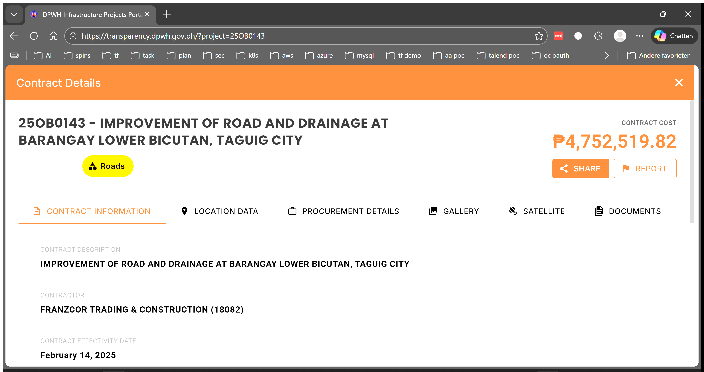
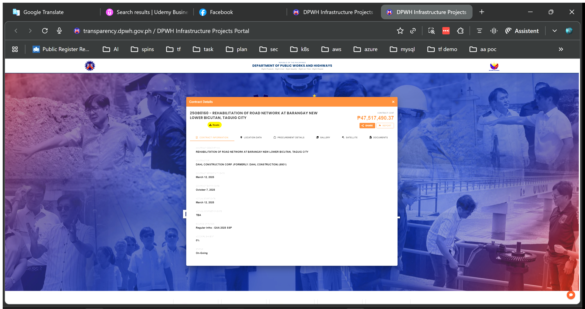
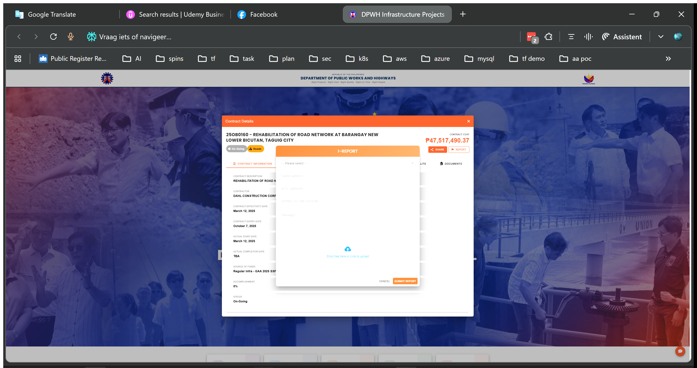
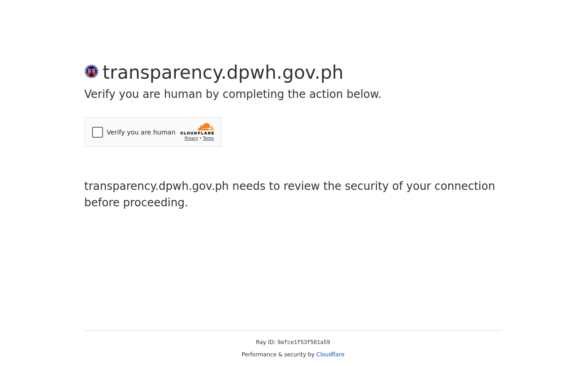

# Repeated Projects Report (2026 Integration)

**Generated At:** 2025-12-18 08:12:54
**Total Projects:** 10

---

## Construction of Multi-Purpose Facilities at Lakeshore, Barangay Lower Bicutan, Taguig City

- **Project ID:** `DPWH-Proj-13618`
- **Historical Match Trigger:** Construction of Multi-Purpose Facilities at Lakeshore, Barangay Lower Bicutan, Taguig City (Phase 5)

### Matched Transparency Contracts (10)

#### Contract: [25OB0118](https://transparency.dpwh.gov.ph/?project=25OB0118)
- **Contract Name:** CONSTRUCTION (COMPLETION) OF BOX CULVERT AT PIO FELIPE, NEW LOWER BICUTAN, TAGUIG CITY
- **Amount:** ₱14,257,282.60

**Portal View:**

**Gallery View:**

#### Contract: [25OB0143](https://transparency.dpwh.gov.ph/?project=25OB0143)
- **Contract Name:** IMPROVEMENT OF ROAD AND DRAINAGE AT BARANGAY LOWER BICUTAN, TAGUIG CITY
- **Amount:** ₱4,752,519.82

**Portal View:**

**Gallery View:**

#### Contract: [25OB0157](https://transparency.dpwh.gov.ph/?project=25OB0157)
- **Contract Name:** REHABILITATION OF ROAD AT BARANGAY NEW LOWER BICUTAN, TAGUIG CITY
- **Amount:** ₱48,009,116.59

**Portal View:**

**Gallery View:**

#### Contract: [25OB0159](https://transparency.dpwh.gov.ph/?project=25OB0159)
- **Contract Name:** REHABILITATION OF ROAD NETWORK AT BARANGAY LOWER BICUTAN, TAGUIG CITY
- **Amount:** ₱48,016,442.10

**Portal View:**

**Gallery View:**

#### Contract: [25OB0160](https://transparency.dpwh.gov.ph/?project=25OB0160)
- **Contract Name:** REHABILITATION OF ROAD NETWORK AT BARANGAY NEW LOWER BICUTAN, TAGUIG CITY
- **Amount:** ₱47,517,490.37

**Portal View:**

**Gallery View:**

#### Contract: [25OB0166](https://transparency.dpwh.gov.ph/?project=25OB0166)
- **Contract Name:** CONSTRUCTION (COMPLETION) OF PUP GYM AT GEN. SANTOS ST., BARANGAY LOWER BICUTAN, TAGUIG CITY
- **Amount:** ₱33,680,951.27

**Portal View:**

**Gallery View:**

#### Contract: [25OB0174](https://transparency.dpwh.gov.ph/?project=25OB0174)
- **Contract Name:** CONSTRUCTION OF DRAINAGE STRUCTURE ALONG ALFREDO STREET, BARANGAY LOWER BICUTAN, TAGUIG CITY
- **Amount:** ₱14,107,529.95

**Portal View:**

**Gallery View:**

#### Contract: [25OB0188](https://transparency.dpwh.gov.ph/?project=25OB0188)
- **Contract Name:** IMPROVEMENT OF ROAD WITH SITE DEVELOPMENT (SOLAR LIGHTING) AT COAST GUARD BASE TAGUIG COMPOUND NEW LOWER BICUTAN, TAGUIG CITY
- **Amount:** ₱5,968,224.12

**Portal View:**

**Gallery View:**

#### Contract: [25OB0320](https://transparency.dpwh.gov.ph/?project=25OB0320)
- **Contract Name:** CONSTRUCTION OF DRAINAGE AT GREEN VILLAGE/CAMP BAGONG DIWA, BARANGAY LOWER BICUTAN, TAGUIG CITY
- **Amount:** ₱23,043,987.68

**Portal View:**

**Gallery View:**

#### Contract: [25OB0334](https://transparency.dpwh.gov.ph/?project=25OB0334)
- **Contract Name:** CONSTRUCTION OF MULTI-PURPOSE FACILITY, BARANGAY LOWER BICUTAN, TAGUIG CITY (PHASE 1)
- **Amount:** ₱145,024,597.00

**Portal View:**

**Gallery View:**

---

## Construction of Multi-Purpose Building, Southern Luzon Multi-Specialty Medical Center, Tayabas City, Quezon

- **Project ID:** `DPWH-Proj-13688`
- **Historical Match Trigger:** Construction of Multi-Purpose Building, Southern Luzon Multi-Specialty Medical Center, Tayabas City, Quezon

### Matched Transparency Contracts (10)

#### Contract: [25O00068](https://transparency.dpwh.gov.ph/?project=25O00068)
- **Contract Name:** CONSTRUCTION OF MULTI-PURPOSE BUILDING, EAST AVENUE MEDICAL CENTER, EAST AVENUE, DILIMAN, QUEZON CITY
- **Amount:** ₱95,052,467.70

**Portal View:**

**Gallery View:**

#### Contract: [25D00078](https://transparency.dpwh.gov.ph/?project=25D00078)
- **Contract Name:** CONSTRUCTION OF MULTI-PURPOSE BUILDING, SOUTHERN LUZON MULTI-SPECIALTY MEDICAL CENTER, TAYABAS CITY, QUEZON
- **Amount:** ₱195,023,204.14

**Portal View:**

**Gallery View:**

#### Contract: [25D00220](https://transparency.dpwh.gov.ph/?project=25D00220)
- **Contract Name:** CONSTRUCTION/IMPROVEMENT OF VARIOUS INFRASTRUCTURES IN SUPPORT OF NATIONAL SECURITY (TATAG NG IMPRASTRAKTURA PARA SA KAPAYAPAAN AT SEGURIDAD PROGRAM - TIKAS), AREA POLICE COMMAND FOR SOUTHERN LUZON COMPLEX AND FACILITIES, LUCENA CITY, QUEZON, PHASE IV
- **Amount:** ₱141,852,305.27

**Portal View:**

**Gallery View:**

#### Contract: [25DL0188](https://transparency.dpwh.gov.ph/?project=25DL0188)
- **Contract Name:** CONVERGENCE AND SPECIAL SUPPORT PROGRAM, BASIC INFRASTRUCTURE PROGRAM (BIP), BIP - MULTI-PURPOSE BUILDINGS/ FACILITIES TO SUPPORT SOCIAL SERVICES, CONSTRUCTION (COMPLETION) OF UNIVERSITY DORMITORY AT SOUTHERN LUZON STATE UNIVERSITY, GUMACA, QUEZON
- **Amount:** ₱28,665,216.57

**Portal View:**

**Gallery View:**

#### Contract: [18DK0091](https://transparency.dpwh.gov.ph/?project=18DK0091)
- **Contract Name:** CONSTRUCTION OF SCIENCE LEARNING RESOURCE CENTER  QUEZON SCIENCE HIGH SCHOOL, BARANGAY ISABANG, TAYABAS CITY-QUEZON
- **Amount:** ₱4,950,000.00

**Portal View:**

**Gallery View:**

#### Contract: [19O00052](https://transparency.dpwh.gov.ph/?project=19O00052)
- **Contract Name:** RETROFITTING OF GOVERNMENT BUILDINGS IN PREPARATION FOR THE BIG ONE - MAIN BUILDING, EAST AVENUE MEDICAL CENTER - EAST AVENUE, QUEZON CITY
- **Amount:** ₱149,477,470.15

**Portal View:**

**Gallery View:**

#### Contract: [19OF0282](https://transparency.dpwh.gov.ph/?project=19OF0282)
- **Contract Name:** RETROFITTING OF GOVERNMENT BUILDING IN PREPARATION FOR THE BIG ONE AT VETERANS MEMORIAL MEDICAL CENTER-WARD 21 NORTH AVE., DILIMAN, QUEZON CITY
- **Amount:** None

**Portal View:**

**Gallery View:**

#### Contract: [19OF0283](https://transparency.dpwh.gov.ph/?project=19OF0283)
- **Contract Name:** RETROFITTING OF GOVERNMENT BUILDING IN PREPARATION FOR THE BIG ONE AT VETERANS MEMORIAL MEDICAL CENTER-OUT PATIENT DEPARTMENT,  NORTH AVE., DILIMAN, QUEZON CITY
- **Amount:** None

**Portal View:**

**Gallery View:**

#### Contract: [19OF0284](https://transparency.dpwh.gov.ph/?project=19OF0284)
- **Contract Name:** RETROFITTING OF GOVERNMENT BUILDING IN PREPARATION FOR THE BIG ONE AT VETERANS MEMORIAL MEDICAL CENTER-TB DOTS,  NORTH AVE., DILIMAN, QUEZON CITY
- **Amount:** None

**Portal View:**

**Gallery View:**

#### Contract: [19OF0285](https://transparency.dpwh.gov.ph/?project=19OF0285)
- **Contract Name:** RETROFITTING OF GOVERNMENT BUILDING IN PREPARATION FOR THE BIG ONE AT VETERANS MEMORIAL MEDICAL CENTER-NURSE HOME, NORTH AVE., DILIMAN, QUEZON CITY
- **Amount:** None

**Portal View:**

**Gallery View:**

---

## Construction of Multi-Purpose Building (RFU-NCR Mega Laboratory Building), 1st Quadrant of Camp Bagong Diwa Along Gen. Santos Ave., Bicutan, Taguig City

- **Project ID:** `DPWH-Proj-11344`
- **Historical Match Trigger:** Construction of Multi-Purpose Building (RFU-NCR Mega Laboratory Building) (with equipment), 1st Quadrant of Camp Bagong Diwa Along Gen. Santos Ave., Bicutan, Taguig City

### Matched Transparency Contracts (10)

#### Contract: [25OB0166](https://transparency.dpwh.gov.ph/?project=25OB0166)
- **Contract Name:** CONSTRUCTION (COMPLETION) OF PUP GYM AT GEN. SANTOS ST., BARANGAY LOWER BICUTAN, TAGUIG CITY
- **Amount:** ₱33,680,951.27

**Portal View:**

**Gallery View:**

#### Contract: [25OB0182](https://transparency.dpwh.gov.ph/?project=25OB0182)
- **Contract Name:** NETWORK DEVELOPMENT PROGRAM - ROAD WIDENING - SECONDARY ROADS - GEN SANTOS AVE - K0025 + 445 - K0025 + 647
- **Amount:** ₱31,177,274.20

**Portal View:**

**Gallery View:**

#### Contract: [25OB0451](https://transparency.dpwh.gov.ph/?project=25OB0451)
- **Contract Name:** CONSTRUCTION OF MULTI-PURPOSE BUILDING (RFU-NCR MEGA LABORATORY BUILDING), 1ST QUADRANT OF CAMP BAGONG DIWA ALONG GEN. SANTOS AVE., BICUTAN, TAGUIG CITY (PHASE V)
- **Amount:** ₱141,782,606.03

**Portal View:**

**Gallery View:**

#### Contract: [25OB0452](https://transparency.dpwh.gov.ph/?project=25OB0452)
- **Contract Name:** CONSTRUCTION OF MULTI-PURPOSE BUILDING (RFU-NCR MEGA LABORATORY BUILDING), 1ST QUADRANT OF CAMP BAGONG DIWA ALONG GEN. SANTOS AVE., BICUTAN, TAGUIG CITY (PHASE VI)
- **Amount:** ₱141,782,392.82

**Portal View:**

**Gallery View:**

#### Contract: [19OB0398](https://transparency.dpwh.gov.ph/?project=19OB0398)
- **Contract Name:** IMPROVEMENT OF MULTI-PURPOSE BUILDING IN TAGUIG CITY UNIVERSITY COMPLEX, GEN. SANTOS AVE., CENTRAL BICUTAN, TAGUIG CITY
- **Amount:** ₱23,969,442.24

**Portal View:**

**Gallery View:**

#### Contract: [19MB0111](https://transparency.dpwh.gov.ph/?project=19MB0111)
- **Contract Name:** CONSTRUCTION OF UNDERGROUND DRAINAGE WITH CURB AND GUTTER COR. DARIMCO ST. PUROK DARIMCO TO DAPROZA AVE. PUROK ACHARON, GEN. SANTOS CITY
- **Amount:** ₱9,896,599.14

**Portal View:**

**Gallery View:**

#### Contract: [20O00032](https://transparency.dpwh.gov.ph/?project=20O00032)
- **Contract Name:** WIDENING OF GENERAL SANTOS AVENUE, BRGY. LOWER BICUTAN TO BRGY. CENTRAL BICUTAN, TAGUIG CITY
- **Amount:** ₱232,564,841.40

**Portal View:**

**Gallery View:**

#### Contract: [20LB0199](https://transparency.dpwh.gov.ph/?project=20LB0199)
- **Contract Name:** RECONSTRUCTION TO CONCRETE PAVEMENT: JCT E. QUIRINO AVE. - MT. APO - GEN. LUNA ST., - MT. MAYON ST. - J. ABAD SANTOS - CAMUS ST. ROAD LEADING TO PEOPLE'S PARK, DAVAO CITY
- **Amount:** ₱19,600,000.00

**Portal View:**

**Gallery View:**

#### Contract: [22OB0084](https://transparency.dpwh.gov.ph/?project=22OB0084)
- **Contract Name:** PREVENTIVE MAINTENANCE ALONG GEN SANTOS AVE - K0025 + (-361) - K0025 + (-291), K0025 + (-879) - K0025 + (-361)
- **Amount:** ₱8,747,644.06

**Portal View:**

**Gallery View:**

#### Contract: [22OB0149](https://transparency.dpwh.gov.ph/?project=22OB0149)
- **Contract Name:** PREVENTIVE MAINTENANCE ALONG GEN SANTOS AVE - K0025 + (-291) - K0025 + 000
- **Amount:** ₱4,329,540.93

**Portal View:**

**Gallery View:**

---

## Construction of Multi-Purpose Building (Gymnasium) Dao, Pagadian City, Zamboanga del Sur

- **Project ID:** `DPWH-Proj-13777`
- **Historical Match Trigger:** Construction of the Multi-Purpose Facility (Gymnasium), Dao, Pagadian City, Zamboanga del Sur

### Matched Transparency Contracts (10)

#### Contract: [25JE0001](https://transparency.dpwh.gov.ph/?project=25JE0001)
- **Contract Name:** BASIC INFRASTRUCTURE PROGRAM (BIP) CONSTRUCTION OF ROAD, BARANGAY DAO, PAGADIAN CITY, ZAMBOANGA DEL SUR
- **Amount:** ₱4,944,885.97

**Portal View:**

**Gallery View:**

#### Contract: [25JE0074](https://transparency.dpwh.gov.ph/?project=25JE0074)
- **Contract Name:** NATIONAL BUILDING PROGRAM- BUILDINGS AND OTHER STRUCTURES; MULTI- PURPOSE/ FACILITIES CONSTRUCTION OF MULTI- PURPOSE BUILDING, (DPWH STORAGE FACILITY), ZAMBOANGA DEL SUR 1ST DEO, BARANGAY DAO, PAGADIAN CITY, ZAMBOANGA DEL SUR
- **Amount:** ₱29,650,168.24

**Portal View:**

**Gallery View:**

#### Contract: [25JE0075](https://transparency.dpwh.gov.ph/?project=25JE0075)
- **Contract Name:** SUSTAINABLE INFRASTRUCTURE PROJECTS ALLEVIATING GAPS (SIPAG) CONSTRUCTION OF ROAD WITH DRAINAGE, DPWH ZAMBOANGA DEL SUR 1ST DEO OFFICE COMPOUND, BARANGAY DAO, PAGADIAN CITY, ZAMBOANGA DEL SUR
- **Amount:** ₱19,579,997.73

**Portal View:**

**Gallery View:**

#### Contract: [17JE0064](https://transparency.dpwh.gov.ph/?project=17JE0064)
- **Contract Name:** CONSTRUCTION OF ACTIVITY CENTER/COVERED COURT,BARANGAY DAO,PAGADIAN CITY, ZAMBOANGA DEL SUR
- **Amount:** ₱4,742,070.31

**Portal View:**

**Gallery View:**

#### Contract: [18JE0079](https://transparency.dpwh.gov.ph/?project=18JE0079)
- **Contract Name:** CONSTRUCTION OF DPWH OFFICE BUILDING, ZAMBOANGA DEL SUR 1ST DEO,DAO, PAGADIAN CITY
- **Amount:** ₱46,993,005.01

**Portal View:**

**Gallery View:**

#### Contract: [18JE0080](https://transparency.dpwh.gov.ph/?project=18JE0080)
- **Contract Name:** CONSTRUCTION OF DPWH STAFF HOUSE BUILDING, ZAMBOANGA DEL SUR 1ST DEO, DAO, PAGADIAN CITY
- **Amount:** ₱5,853,930.24

**Portal View:**

**Gallery View:**

#### Contract: [18JE0083](https://transparency.dpwh.gov.ph/?project=18JE0083)
- **Contract Name:** CONSTRUCTION/RENOVATION OF GYMNASIUM,ZAMBOANGA DEL SUR NATIONAL HIGH SCHOOL,BARANGAY STA., MARIA, PAGADIAN CITY, ZAMBOANAG DEL SUR
- **Amount:** ₱4,930,000.00

**Portal View:**

**Gallery View:**

#### Contract: [19JE0097](https://transparency.dpwh.gov.ph/?project=19JE0097)
- **Contract Name:** CONSTRUCTION OF COVERED COURT, PROVINCIAL GOVERNMENT CENTER, DAO, PAGADIAN CITY, ZAMBOANGA DEL SUR
- **Amount:** ₱4,934,859.19

**Portal View:**

**Gallery View:**

#### Contract: [19JE0131](https://transparency.dpwh.gov.ph/?project=19JE0131)
- **Contract Name:** CONSTRUCTION/ REHABILITATION OF ACCESSIBILITY FACILITY FOR PHYSICALLY CHALLENGE PERSONS IN ZAMBOANGA DEL SUR, DPWH 1ST, DEO, DAO, PAGADIAN CITY
- **Amount:** ₱2,047,216.65

**Portal View:**

**Gallery View:**

#### Contract: [20J00222](https://transparency.dpwh.gov.ph/?project=20J00222)
- **Contract Name:** CONSTRUCTION/REPAIR/REHABILITATION/IMPROVEMENT OF VARIOUS INFRASTRUCTURE INCLUDING LOCAL PROJECTS STRUCTURAL IMPROVEMENT OF PUBLIC BUILDING AND CONSTRUCTION OF EVACUATION CENTERS REGION IX, BRGY. DAO, PAGADIAN CITY, ZAMBOANGA DEL SUR
- **Amount:** ₱34,681,920.42

**Portal View:**

**Gallery View:**

---

## Construction of Multi-Purpose Building, Department of Health Regional Office - Region 4A, Lipa City, Batangas

- **Project ID:** `DPWH-Proj-11356`
- **Historical Match Trigger:** Construction of Multi-Purpose Building, Department of Health Regional Office - Region 4A (Phase 3), Lipa City, Batangas

### Matched Transparency Contracts (10)

#### Contract: [25D00104](https://transparency.dpwh.gov.ph/?project=25D00104)
- **Contract Name:** CONSTRUCTION OF MULTI-PURPOSE BUILDING INCLUDING FACILITIES (DEPARTMENT OF AGRICULTURE), BRGY. MARAWOY, LIPA CITY, BATANGAS
- **Amount:** ₱141,861,332.76

**Portal View:**

**Gallery View:**

#### Contract: [25D00171](https://transparency.dpwh.gov.ph/?project=25D00171)
- **Contract Name:** CONSTRUCTION OF MULTI-PURPOSE BUILDING LAND TRANSPORTATION REGIONAL OFFICE - REGION 4A, LIPA CITY, BATANGAS
- **Amount:** ₱140,331,190.31

**Portal View:**

**Gallery View:**

#### Contract: [25DD0196](https://transparency.dpwh.gov.ph/?project=25DD0196)
- **Contract Name:** CONVERGENCE AND SPECIAL SUPPORT PROGRAM, BASIC INFRASTRUTURE PROGRAM (BIP), MULTI-PURPOSE BUILDINGS/ FACILITIES TO SUPPORT SOCIAL SERVICES, CONSTRUCTION OF MULTI-PURPOSE BUILDING (DAYCARE CENTER & HEALTH CENTER) AT BRGY MABINI, LIPA CITY BATANGAS
- **Amount:** ₱9,603,193.29

**Portal View:**

**Gallery View:**

#### Contract: [17DD0140](https://transparency.dpwh.gov.ph/?project=17DD0140)
- **Contract Name:** VARIOUS INFRASTRUCTURE INCLUDING LOCAL PROJECTS - CONSTRUCTION OF THREE (3) STOREY DPWH BUILDING (OFFICE AND QUARTER), BATANGAS IV-DEO, LIPA CITY, BATANGAS
- **Amount:** ₱14,850,000.00

**Portal View:**

**Gallery View:**

#### Contract: [18DD0275](https://transparency.dpwh.gov.ph/?project=18DD0275)
- **Contract Name:** LOCAL PROGRAM, LOCAL INFRASTRUCTURE PROGRAM, BUILDINGS AND OTHER STRUCTURES, MULTIPURPOSE/FACILITIES, CONSTRUCTION OF A MULTI-PURPOSE BUILDING, NATIONAL BUREAU OF INVESTIGATION (NBI) REGION IV-A OFFICE, LIPA CITY, BATANGAS
- **Amount:** ₱29,408,811.60

**Portal View:**

**Gallery View:**

#### Contract: [18DD0302](https://transparency.dpwh.gov.ph/?project=18DD0302)
- **Contract Name:** LOCAL PROGRAM, CONSTRUCTION/ REPAIR/ REHABILITATION/ IMPROVEMENT OF VARIOUS INFRASTRUCTURE INCLUDING LOCAL PROJECTS, BUILDINGS AND OTHER STRUCTURES, MULTIPURPOSE/ FACILITIES, REHABILITATION/ IMPROVEMENT OF DEPED LIPA DIVISION OFFICE, LIPA CITY, BATANGAS
- **Amount:** ₱14,701,524.29

**Portal View:**

**Gallery View:**

#### Contract: [18DD0652](https://transparency.dpwh.gov.ph/?project=18DD0652)
- **Contract Name:** CONSTRUCTION/REHABILITATION/IMPROVEMENT OF MULTIPURPOSE BUILDING, DEPARTMENT OF PUBLIC WORKS AND HIGHWAYS BATANGAS IV DISTRICT ENGINEERING OFFICE, LIPA CITY, BATANGAS
- **Amount:** ₱65,523,500.00

**Portal View:**

**Gallery View:**

#### Contract: [18DD0275](https://transparency.dpwh.gov.ph/?project=18DD0275)
- **Contract Name:** LOCAL PROGRAM, LOCAL INFRASTRUCTURE PROGRAM, BUILDINGS AND OTHER STRUCTURES, MULTIPURPOSE/FACILITIES, CONSTRUCTION OF A MULTI-PURPOSE BUILDING, NATIONAL BUREAU OF INVESTIGATION (NBI) REGION IV-A OFFICE, LIPA CITY, BATANGAS
- **Amount:** ₱29,408,811.60

**Portal View:**

**Gallery View:**

#### Contract: [18DD0302](https://transparency.dpwh.gov.ph/?project=18DD0302)
- **Contract Name:** LOCAL PROGRAM, CONSTRUCTION/ REPAIR/ REHABILITATION/ IMPROVEMENT OF VARIOUS INFRASTRUCTURE INCLUDING LOCAL PROJECTS, BUILDINGS AND OTHER STRUCTURES, MULTIPURPOSE/ FACILITIES, REHABILITATION/ IMPROVEMENT OF DEPED LIPA DIVISION OFFICE, LIPA CITY, BATANGAS
- **Amount:** ₱14,701,524.29

**Portal View:**

**Gallery View:**

#### Contract: [18DD0652](https://transparency.dpwh.gov.ph/?project=18DD0652)
- **Contract Name:** CONSTRUCTION/REHABILITATION/IMPROVEMENT OF MULTIPURPOSE BUILDING, DEPARTMENT OF PUBLIC WORKS AND HIGHWAYS BATANGAS IV DISTRICT ENGINEERING OFFICE, LIPA CITY, BATANGAS
- **Amount:** ₱65,523,500.00

**Portal View:**

**Gallery View:**

---

## Completion of Multi-Purpose Building (City Environment and Management Office (CEMO) Complex), Barangay Sto. Nino, Marikina City

- **Project ID:** `DPWH-Proj-13567`
- **Historical Match Trigger:** Construction of Multi-Purpose Building, (City Environment and Management Office (CEMO) Complex), Brgy. Sto. Nino Marikina City

### Matched Transparency Contracts (10)

#### Contract: [23OB0304](https://transparency.dpwh.gov.ph/?project=23OB0304)
- **Contract Name:** CONSTRUCTION OF MULTI-PURPOSE BUILDING, (CITY ENVIRONMENT AND MANAGEMENT OFFICE (CEMO) COMPLEX), BRGY. STO. NINO MARIKINA CITY
- **Amount:** ₱37,690,582.90

**Portal View:**

**Gallery View:**

#### Contract: [23OB0304](https://transparency.dpwh.gov.ph/?project=23OB0304)
- **Contract Name:** CONSTRUCTION OF MULTI-PURPOSE BUILDING, (CITY ENVIRONMENT AND MANAGEMENT OFFICE (CEMO) COMPLEX), BRGY. STO. NINO MARIKINA CITY
- **Amount:** ₱37,690,582.90

**Portal View:**

**Gallery View:**

#### Contract: [18EB0161](https://transparency.dpwh.gov.ph/?project=18EB0161)
- **Contract Name:** CLUSTER 2018RWCS-01 CONSTRUCTION OF VARIOUS RAINWATER COLLECTION SYSTEM RWCS, A) SABLAYAN SPORTS COMPLEX, BRGY. STO. NINO, B) SABLAYAN NATIONAL COMPREHENSIVE HIGH SCHOOL, BRGY. STO. NNO, C) BUENAVISTA EVACUATION CENTER, BRGY. BUENAVISTA, D) BUENAVISTA E
- **Amount:** ₱2,655,626.22

**Portal View:**

**Gallery View:**

#### Contract: [25OB0424](https://transparency.dpwh.gov.ph/?project=25OB0424)
- **Contract Name:** REHABILITATION OF MULTI-PURPOSE HALL, BARANGAY STO NIÑO, MARIKINA CITY
- **Amount:** ₱9,694,920.00

**Portal View:**

**Gallery View:**

#### Contract: [25BK0085](https://transparency.dpwh.gov.ph/?project=25BK0085)
- **Contract Name:** FLOOD MANAGEMENT PROGRAM - CONSTRUCTION/ REHABILITATION OF FLOOD MITIGATION FACILITIES WITHIN MAJOR RIVER BASINS AND PRINCIPAL RIVERS - CONSTRUCTION OF CAGAYAN RIVER FLOOD CONCTROL (STO. NIÑO SECTION), MADDELA, QUIRINO
- **Amount:** ₱28,081,383.72

**Portal View:**

**Gallery View:**

#### Contract: [17OB0089](https://transparency.dpwh.gov.ph/?project=17OB0089)
- **Contract Name:** CONSTRUCTION OF J. P. RIZAL DRAINAGE OUTFALL INCLUDING LATERALS, BRGY. STO. NIÑO, MARIKINA CITY 1ST LD
- **Amount:** ₱18,499,948.14

**Portal View:**

**Gallery View:**

#### Contract: [17OB0270](https://transparency.dpwh.gov.ph/?project=17OB0270)
- **Contract Name:** CONSTRUCTION OF TWO UNITS MULTI-PURPOSE BUILDING, STO. NIÑO, MARIKINA CITY
- **Amount:** ₱2,845,470.50

**Portal View:**

**Gallery View:**

#### Contract: [18OB0039](https://transparency.dpwh.gov.ph/?project=18OB0039)
- **Contract Name:** REHABILITATION OF SLOPE PROTECTION AND DESILTING OF BALANTI CREEK, BRGY. STO. NIÑO, MARIKINA CITY, STA. 0+000 TO STA. 1+830
- **Amount:** ₱27,487,461.18

**Portal View:**

**Gallery View:**

#### Contract: [18OB0099](https://transparency.dpwh.gov.ph/?project=18OB0099)
- **Contract Name:** REHABILITATION OF ROAD NETWORK AT HOMEOWNERS DRIVE, BRGY. STO. NIÑO, MARIKINA CITY
- **Amount:** ₱2,819,059.78

**Portal View:**

**Gallery View:**

#### Contract: [18OB0116](https://transparency.dpwh.gov.ph/?project=18OB0116)
- **Contract Name:** CONSTRUCTION OF MULTI-PURPOSE BUILDING, BRGY. STO. NIÑO, MARIKINA CITY
- **Amount:** ₱4,797,999.27

**Portal View:**

**Gallery View:**

---

## Construction of Multi-Purpose Building (Training and Instructional Facility/Meetings Incentives Conferences for Education, Sports Building (Mices) and Primary health Center), Phase 2, Milagros, Masbate

- **Project ID:** `DPWH-Proj-13423`
- **Historical Match Trigger:** Construction of Multi-Purpose Bldg. (Training And Instructional Facility/Meetings Incentives Conferences for Education, Sports Building (Mices) and Primary Health Center), Masbate

### Matched Transparency Contracts (10)

#### Contract: [23F00113](https://transparency.dpwh.gov.ph/?project=23F00113)
- **Contract Name:** CONVERGENCE AND SPECIAL SUPPORT PROGRAM-SUSTAINABLE INFRASTRUCTURE PROJECTS ALLEVIATING GAPS(SIPAG)-MULTI-PURPOSE BUILDINGS/FACILITIES TO SUPPORT SOCIAL SERVICES-CONSTRUCTION OF MULTI-PURPOSE TRAINING AND INSTRUCTIONAL FACILITY/MEETINGS INCENTIVES CONFERE
- **Amount:** ₱144,749,906.71

**Portal View:**

**Gallery View:**

#### Contract: [23F00201](https://transparency.dpwh.gov.ph/?project=23F00201)
- **Contract Name:** CONVERGENCE AND SPECIAL SUPPORT PROGRAM-SUSTAINABLE INFRASTRUCTURE PROJECTS ALLEVIATING GAPS (SIPAG)-MULTI-PURPOSE BUILDINGS/FACILITIES TO SUPPORT SOCIAL SERVICES-CONSTRUCTION OF MULTI-PURPOSE TRAINING AND INSTRUCTIONAL FACILITY/MEETINGS INCENTIVES CONFER
- **Amount:** ₱144,749,709.47

**Portal View:**

**Gallery View:**

#### Contract: [23F00350](https://transparency.dpwh.gov.ph/?project=23F00350)
- **Contract Name:** CONVERGENCE AND SPECIAL SUPPORT PROGRAM-BASIC INFRASTRUCTURE PROGRAM (BIP)-MULTI-PURPOSE BUILDINGS/FACILITIES TO SUPPORT SOCIAL SERVICES-CONSTRUCTION OF MULTI-PURPOSE BLDG. (TRAINING AND INSTRUCTIONAL FACILITY/MEETINGS INCENTIVES CONFERENCES FOR EDUCATION
- **Amount:** ₱96,913,165.38

**Portal View:**

**Gallery View:**

#### Contract: [23F00399](https://transparency.dpwh.gov.ph/?project=23F00399)
- **Contract Name:** CONVERGENCE AND SPECIAL SUPPORT PROGRAM-BASIC INFRASTRUCTURE PROGRAM (BIP)-MULTI-PURPOSE BUILDINGS/FACILITIES TO SUPPORT SOCIAL SERVICES-CONSTRUCTION OF MULTI-PURPOSE BLDG. (TRAINING AND INSTRUCTIONAL FACILITY/MEETINGS INCENTIVES CONFERENCES FOR EDUCATION
- **Amount:** None

**Portal View:**

**Gallery View:**

#### Contract: [23F00400](https://transparency.dpwh.gov.ph/?project=23F00400)
- **Contract Name:** CONVERGENCE AND SPECIAL SUPPORT PROGRAM-BASIC INFRASTRUCTURE PROGRAM (BIP)-MULTI-PURPOSE BUILDINGS/FACILITIES TO SUPPORT SOCIAL SERVICES-CONSTRUCTION OF MULTI-PURPOSE BLDG. (TRAINING AND INSTRUCTIONAL FACILITY/MEETINGS INCENTIVES CONFERENCES FOR EDUCATION
- **Amount:** ₱97,000,000.00

**Portal View:**

**Gallery View:**

#### Contract: [23F00401](https://transparency.dpwh.gov.ph/?project=23F00401)
- **Contract Name:** CONVERGENCE AND SPECIAL SUPPORT PROGRAM-BASIC INFRASTRUCTURE PROGRAM (BIP)-MULTI-PURPOSE BUILDINGS/FACILITIES TO SUPPORT SOCIAL SERVICES-CONSTRUCTION OF MULTI-PURPOSE BLDG. (TRAINING AND INSTRUCTIONAL FACILITY/MEETINGS INCENTIVES CONFERENCES FOR EDUCATION
- **Amount:** ₱96,292,086.79

**Portal View:**

**Gallery View:**

#### Contract: [23F00402](https://transparency.dpwh.gov.ph/?project=23F00402)
- **Contract Name:** CONVERGENCE AND SPECIAL SUPPORT PROGRAM-BASIC INFRASTRUCTURE PROGRAM (BIP)-MULTI-PURPOSE BUILDINGS/FACILITIES TO SUPPORT SOCIAL SERVICES-CONSTRUCTION OF MULTI-PURPOSE BLDG. (TRAINING AND INSTRUCTIONAL FACILITY/MEETINGS INCENTIVES CONFERENCES FOR EDUCATION
- **Amount:** ₱96,127,973.00

**Portal View:**

**Gallery View:**

#### Contract: [23F00403](https://transparency.dpwh.gov.ph/?project=23F00403)
- **Contract Name:** CONVERGENCE AND SPECIAL SUPPORT PROGRAM-BASIC INFRASTRUCTURE PROGRAM (BIP)-MULTI-PURPOSE BUILDINGS/FACILITIES TO SUPPORT SOCIAL SERVICES-CONSTRUCTION OF MULTI-PURPOSE BLDG. (TRAINING AND INSTRUCTIONAL FACILITY/MEETINGS INCENTIVES CONFERENCES FOR EDUCATION
- **Amount:** ₱96,844,098.86

**Portal View:**

**Gallery View:**

#### Contract: [23F00414](https://transparency.dpwh.gov.ph/?project=23F00414)
- **Contract Name:** CONVERGENCE AND SPECIAL SUPPORT PROGRAM-SUSTAINABLE INFRASTRUCTURE PROJECTS ALLEVIATING GAPS (SIPAG)-MULTI-PURPOSE BUILDINGS/FACILITIES TO SUPPORT SOCIAL SERVICES-CONSTRUCTION OF MULTI-PURPOSE TRAINING AND INSTRUCTIONAL FACILITY/MEETINGS INCENTIVES CONFER
- **Amount:** ₱144,748,935.98

**Portal View:**

**Gallery View:**

#### Contract: [23FB0206](https://transparency.dpwh.gov.ph/?project=23FB0206)
- **Contract Name:** SIPAG: MULTI-PURPOSE BUILDINGS/FACILITIES TO SUPPORT SOCIAL SERVICES, CONSTRUCTION OF MULTI PURPOSE TRAINING AND INSTRUCTIONAL FACILITY/MEETINGS INCENTIVES CONFERENCES FOR EDUCATION, SPORTS BUILDING (MICES) AND PRIMARY HEALTH CENTERS AT DARAGA, ALBAY
- **Amount:** ₱71,800,737.18

**Portal View:**

**Gallery View:**

---

## Construction of Multi-Purpose Building, Barangay San Miguel, Jordan, Guimaras

- **Project ID:** `DPWH-Proj-13727`
- **Historical Match Trigger:** Construction of Multi-Purpose Building, Barangay San Miguel, Jordan, Guimaras

### Matched Transparency Contracts (10)

#### Contract: [25G00086](https://transparency.dpwh.gov.ph/?project=25G00086)
- **Contract Name:** CONSTRUCTION OF MULTI- PURPOSE BUILDING (DR. CATALINO GALLEGO NAVA MEDICAL CENTER MULTI- PURPOSE FACILITY 2), PROVINCIAL CAPITAL GROUNDS, BARANGAY SAN MIGUEL, JORDAN, GUIMARAS)
- **Amount:** ₱48,150,423.42

**Portal View:**

**Gallery View:**

#### Contract: [25GE0015](https://transparency.dpwh.gov.ph/?project=25GE0015)
- **Contract Name:** CONSTRUCTION OF MULTI-PURPOSE BUILDING-CONSTRUCTION (COMPLETION) OF MULTI-PURPOSE BUILDING, DPWH GUIMARAS DEO, SAN MIGUEL, JORDAN, GUIMARAS
- **Amount:** ₱19,495,907.24

**Portal View:**

**Gallery View:**

#### Contract: [25GE0022](https://transparency.dpwh.gov.ph/?project=25GE0022)
- **Contract Name:** CONSTRUCTION OF OTHER BUILDING - CONSTRUCTION OF QUALITY ASSURANCE BUILDING, DPWH GUIMARAS DEO, SAN MIGUEL, JORDAN, GUIMARAS
- **Amount:** ₱29,299,874.40

**Portal View:**

**Gallery View:**

#### Contract: [25GE0030](https://transparency.dpwh.gov.ph/?project=25GE0030)
- **Contract Name:** CONSTRUCTION OF MULTI-PURPOSE BUILDING-CONSTRUCTION OF MULTI-PURPOSE BUILDING (GUIMARAS ARENA AND CONVENTION CENTER), BARANGAY SAN MIGUEL, JORDAN, GUIMARAS
- **Amount:** ₱34,549,999.57

**Portal View:**

**Gallery View:**

#### Contract: [25GE0031](https://transparency.dpwh.gov.ph/?project=25GE0031)
- **Contract Name:** CONSTRUCTION OF OTHER BUILDING-CONSTRUCTION (COMPLETION) OF DPWH GUIMARAS DISTRICT ENGINEERING OFFICE EXTENSION BUILDING, SAN MIGUEL, JORDAN, GUIMARAS
- **Amount:** ₱9,699,959.96

**Portal View:**

**Gallery View:**

#### Contract: [19GE0056](https://transparency.dpwh.gov.ph/?project=19GE0056)
- **Contract Name:** CONSTRUCTION OF MULTI-PURPOSE BUILDING, BRGY. SAN MIGUEL, JORDAN, GUIMARAS
- **Amount:** ₱1,410,582.18

**Portal View:**

**Gallery View:**

#### Contract: [19GE0149](https://transparency.dpwh.gov.ph/?project=19GE0149)
- **Contract Name:** CONSTRUCTION OF MULTI-PURPOSE BUILDING IN INDIGENOUS PEOPLE'S RELOCATION SITE, BRGY. SAN MIGUEL, JORDAN, GUIMARAS
- **Amount:** ₱940,504.84

**Portal View:**

**Gallery View:**

#### Contract: [20GE0009](https://transparency.dpwh.gov.ph/?project=20GE0009)
- **Contract Name:** CONSTRUCTION OF MULTI-PURPOSE BUILDING (PHASE II), BRGY. SAN MIGUEL, JORDAN, GUIMARAS
- **Amount:** ₱1,880,827.89

**Portal View:**

**Gallery View:**

#### Contract: [20GE0037](https://transparency.dpwh.gov.ph/?project=20GE0037)
- **Contract Name:** CONSTRUCTION OF MULTI-PURPOSE BUILDING, BRGY. SAN MIGUEL, JORDAN, GUIMARAS
- **Amount:** ₱2,821,501.27

**Portal View:**

**Gallery View:**

#### Contract: [20GE0088](https://transparency.dpwh.gov.ph/?project=20GE0088)
- **Contract Name:** CONSTRUCTION/IMPROVEMENT OF JORDAN TERMINAL MARKET, BRGY. SAN MIGUEL, JORDAN, GUIMARAS
- **Amount:** ₱4,702,510.73

**Portal View:**

**Gallery View:**

---

## Construction of Multi-Purpose Building, Right Wing (Phase 2) of Gov. Benjamin T. Romualdez General Hospital and Schistosomiases Center (GBTRGH-SC), Palo, Leyte

- **Project ID:** `DPWH-Proj-11894`
- **Historical Match Trigger:** Rehabilitation of Multi-Purpose Building, Right Wing of Gov. Benjamin T. Romualdez General Hospital and Schistosomiases Center (GBTRGH-SC), Palo, Leyte

### Matched Transparency Contracts (10)

#### Contract: [17PC0016](https://transparency.dpwh.gov.ph/?project=17PC0016)
- **Contract Name:** CONSTRUCTION OF MPB, FAR NORTH LUZON GENERAL HOSPITAL AND TRAINING CENTER, LUNA, APAYAO
- **Amount:** ₱4,939,902.49

**Portal View:**

**Gallery View:**

#### Contract: [20KE0062](https://transparency.dpwh.gov.ph/?project=20KE0062)
- **Contract Name:** CONST. OF MPB (DIALYSIS CENTER) CAMIGUIN GENERAL HOSPITAL,POBLACION,MAMBAJAO,CAMIGUIN
- **Amount:** ₱14,104,731.27

**Portal View:**

**Gallery View:**

#### Contract: [20KE0063](https://transparency.dpwh.gov.ph/?project=20KE0063)
- **Contract Name:** CONST. OF MPB (DIALYSIS CENTER) CAMIGUIN GENERAL HOSPITAL,POBLACION,MAMBAJAO,CAMIGUIN (10M)
- **Amount:** ₱9,400,159.40

**Portal View:**

**Gallery View:**

#### Contract: [21O00075](https://transparency.dpwh.gov.ph/?project=21O00075)
- **Contract Name:** CONSTRUCTION OF LAS PIÑAS GENERAL HOSPITAL AND SATELLITE TRAUMA CENTER BUILDING, BRGY. PULANGLUPA 1, LAS PIÑAS CITY
- **Amount:** ₱494,855,949.05

**Portal View:**

**Gallery View:**

#### Contract: [21CB0048](https://transparency.dpwh.gov.ph/?project=21CB0048)
- **Contract Name:** CONSTRUCTION OF MULTIPURPOSE BUILDING (WELLNESS CENTER BUILDING), MARIVELES MENTAL WELLNESS AND GENERAL HOSPITAL, MARIVELES, BATAAN
- **Amount:** ₱52,334,845.00

**Portal View:**

**Gallery View:**

#### Contract: [22OI0149](https://transparency.dpwh.gov.ph/?project=22OI0149)
- **Contract Name:** CONSTRUCTION OF LAS PINAS GENERAL HOSPITAL AND SATELLITE TRAUMA CENTER, PULANGLUPA I, LAS PINAS CITY
- **Amount:** ₱29,380,242.66

**Portal View:**

**Gallery View:**

#### Contract: [22KE0074](https://transparency.dpwh.gov.ph/?project=22KE0074)
- **Contract Name:** CONSTRUCTION OF CAMIGUIN GENERAL HOSPITAL DIALYSIS CENTER
- **Amount:** ₱9,854,102.21

**Portal View:**

**Gallery View:**

#### Contract: [23OB0387](https://transparency.dpwh.gov.ph/?project=23OB0387)
- **Contract Name:** CONSTRUCTION OF MULTI-PURPOSE BUILDING AT THE NATIONAL CENTER FOR MENTAL HEALTH (PACKAGE 3) DESIGNATED AS THE SENATE PRESIDENT NEPTALI A. GONZALES GENERAL HOSPITAL, MANDALUYONG CITY
- **Amount:** ₱71,258,250.31

**Portal View:**

**Gallery View:**

#### Contract: [23OB0388](https://transparency.dpwh.gov.ph/?project=23OB0388)
- **Contract Name:** CONSTRUCTION OF MULTI-PURPOSE BUILDING AT THE NATIONAL CENTER FOR MENTAL HEALTH (PACKAGE 4) DESIGNATED AS THE SENATE PRESIDENT NEPTALI A. GONZALES GENERAL HOSPITAL, MANDALUYONG CITY
- **Amount:** ₱71,260,406.84

**Portal View:**

**Gallery View:**

#### Contract: [23OI0105](https://transparency.dpwh.gov.ph/?project=23OI0105)
- **Contract Name:** CONSTRUCTION OF HOSPITAL BUILDING OF LAS PINAS GENERAL HOSPITAL AND SATELLITE TRAUMA CENTER, PULANGLUPA 1, LAS PINAS CITY
- **Amount:** ₱153,425,875.40

**Portal View:**

**Gallery View:**

---

## Construction of Multi-Purpose Building, Benguet Convention Center, Phase V, Barangay Wangal, La Trinidad, Benguet

- **Project ID:** `DPWH-Proj-13420`
- **Historical Match Trigger:** Construction of Multi-Purpose Building, Benguet Convention Center, Phase IV, Barangay Wangal, La Trinidad, Benguet

### Matched Transparency Contracts (10)

#### Contract: [20PE0070](https://transparency.dpwh.gov.ph/?project=20PE0070)
- **Contract Name:** COMPLETION OF BENGUET SPORT GYMNASIUM, WANGAL, LA TRINIDAD, BENGUET
- **Amount:** ₱4,936,013.73

**Portal View:**

**Gallery View:**

#### Contract: [21P00023](https://transparency.dpwh.gov.ph/?project=21P00023)
- **Contract Name:** LOCAL PROGRAM: LOCAL INFRASTRUCTURE PROGRAM - BUILDINGS AND OTHER STRUCTURES - MULTIPURPOSE/ FACILITIES - CONSTRUCTION/ REHABILITATION OF MULTI-PURPOSE BUILDING (BENGUET SPORTS COMPLEX AND FACILITIES) AT BARANGAY WANGAL, LA TRINIDAD, BENGUET
- **Amount:** ₱163,350,000.00

**Portal View:**

**Gallery View:**

#### Contract: [21PE0051](https://transparency.dpwh.gov.ph/?project=21PE0051)
- **Contract Name:** CONSTRUCTION OF MULTI-PURPOSE BUILDING (GYMNASIUM), BENGUET SPORTS COMPLEX, WANGAL, LA TRINIDAD, BENGUET
- **Amount:** ₱24,679,998.98

**Portal View:**

**Gallery View:**

#### Contract: [21PE0059](https://transparency.dpwh.gov.ph/?project=21PE0059)
- **Contract Name:** IMPROVEMENT OF TALINGUROY BARANGAY ROAD, WANGAL, LA TRINIDAD, BENGUET
- **Amount:** ₱4,916,417.42

**Portal View:**

**Gallery View:**

#### Contract: [21PE0109](https://transparency.dpwh.gov.ph/?project=21PE0109)
- **Contract Name:** CONSTRUCTION OF MULTI-PURPOSE BUILDING (COVERED COURT PHASE 1) AT BARANGAY WANGAL, LA TRINIDAD, BENGUET
- **Amount:** ₱5,930,831.69

**Portal View:**

**Gallery View:**

#### Contract: [22PE0065](https://transparency.dpwh.gov.ph/?project=22PE0065)
- **Contract Name:** CONSTRUCTION OF ROAD, DISAY SHELPI, WANGAL, LA TRINIDAD, BENGUET
- **Amount:** ₱4,849,760.97

**Portal View:**

**Gallery View:**

#### Contract: [22PE0123](https://transparency.dpwh.gov.ph/?project=22PE0123)
- **Contract Name:** CONSTRUCTION OF EVACUATION CENTER AT BARANGAY ALAPANG, LA TRINIDAD, BENGUET
- **Amount:** ₱4,944,132.59

**Portal View:**

**Gallery View:**

#### Contract: [22PE0172](https://transparency.dpwh.gov.ph/?project=22PE0172)
- **Contract Name:** CONSTRUCTION (COMPLETION) OF MULTI-PURPOSE BUILDING, SITIO GULON, AMBIONG BESIDE GULON DAY CARE CENTER, AMBIONG, LA TRINIDAD, BENGUET
- **Amount:** ₱2,940,000.00

**Portal View:**

**Gallery View:**

#### Contract: [23P00043](https://transparency.dpwh.gov.ph/?project=23P00043)
- **Contract Name:** CONVERGENCE AND SPECIAL SUPPORT PROGRAM - BASIC INFRASTRUCTURE PROGRAM (BIP) - MULTI-PURPOSE BUILDINGS/FACILITIES TO SUPPORT SOCIAL SERVICES - CONSTRUCTION OF MULTI PURPOSE BUILDING PHASE III, AT BARANGAY WANGAL, LA TRINIDAD, BENGUET
- **Amount:** ₱41,487,987.31

**Portal View:**

**Gallery View:**

#### Contract: [23P00044](https://transparency.dpwh.gov.ph/?project=23P00044)
- **Contract Name:** CONVERGENCE AND SPECIAL SUPPORT PROGRAM-BASIC INFRASTRUCTURE PROGRAM (BIP)-MULTI-PURPOSE BUILDINGS/FACILITIES TO SUPPORT SOCIAL SERVICES-CONSTRUCTION OF MULTI-PURPOSE BUILDING (BENGUET SPORTS COMPLEX AND FACILITIES), WANGAL, LA TRINIDAD, BENGUET (PHASE 3)
- **Amount:** ₱49,430,904.81

**Portal View:**

**Gallery View:**

---

